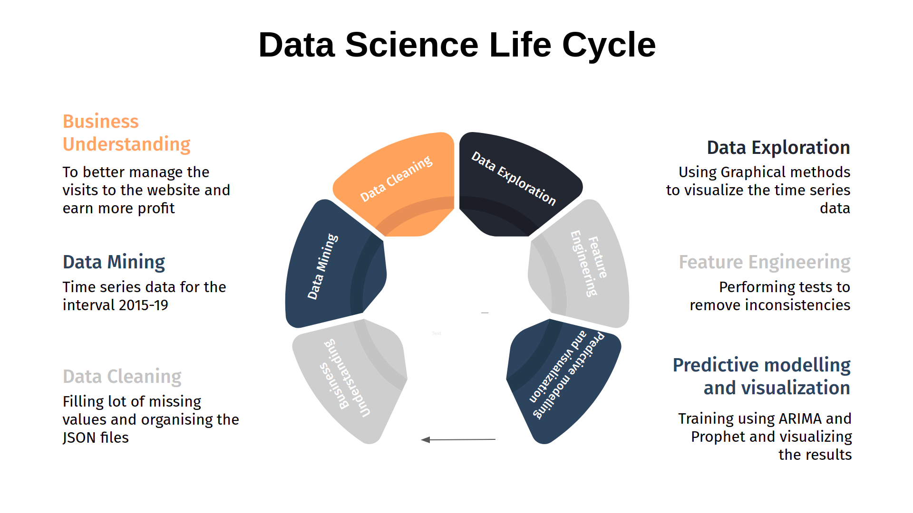

# Web Traffic Forecasting


This Repository is to analyse the web traffic of a website for a particular time interval using Time Series Analysis and forecast the same for the future. The website chosen for analysis here is [Wikipedia](https://www.wikipedia.org/). 
The scripts are in iPython Notebook (ipynb) format.



This Analysis adapts the flow of the Data Science Life Cycle.

## Initial Setup

```
git clone https://github.com/San411/Time-Series-Analysis.git
pip3 install -r requirements.txt
```
## Data Mining

We take the wikipedia page views for 145k articles for the year 2015-2017 on a daily basis. This will form our dataset for training.
First download the dataset provided by Google from [Kaggle](https://www.kaggle.com/c/web-traffic-time-series-forecasting/data). This should not take long. Save the data as 'data_2015-17.csv' in the 'Datasets' folder.
To get the validation data use the wikipedia pageview API to request for further article pageviews for the year 2018-19 on a Daily basis. Refer [Pageview API](https://wikimedia.org/api/rest_v1/) documentation.
The REST API returns the JSON data which is further stored in a file to access later. Create a folder named 'json_files' in Datasets
Now execute the **data_mining.ipynb**. The files will take long to download. 
The JSON data will look like this.
```
{"project": "en.wikipedia",
  "article": "!vote", 
  "granularity": "daily",
  "timestamp": "2018010100",
  "access": "all-access", 
  "agent": "all-agents",
  "views": 9}
```

## Data Cleaning and Exploration

Execute the 2 scripts in the following order:
 ```
 data_cleaning.ipynb
 data_exploration.ipynb 
 ```
The cleaned data will be saved in the datasets folder.

View Plot for a sample dataset after exploration


## Feature Engineering

Results of Rolling Statistics 


After performing the Augmented Dickey Fuller Test the flattened data is stored in the datasets folder.

## ARIMA


 Mean Absolute Error : 28.318
 
 Mean Squared Error : 2110.667
 
 Root Mean Squared Error : 45.941

## FACEBOOK - PROPHET


 Mean Absolute Error : 220.883
 
 Mean Squared Error : 75844.554
 
 Root Mean Squared Error : 275.398
 
 SMAPE Score : 42.966


